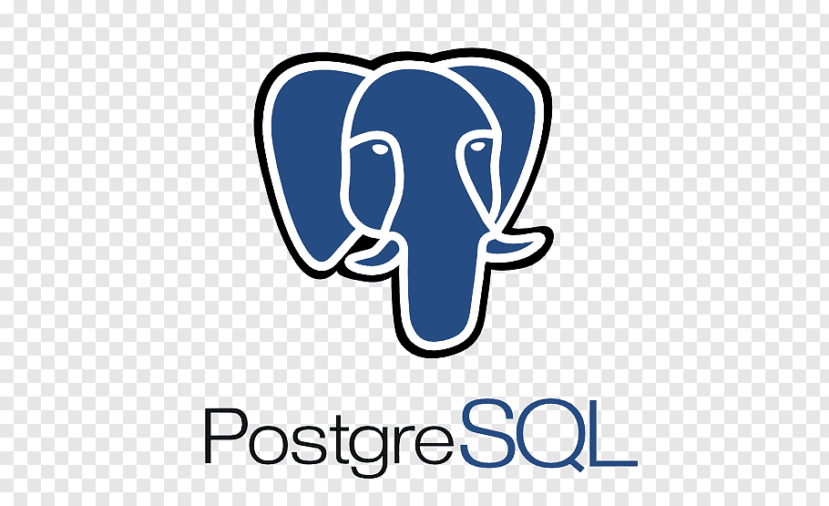

## Hi there, Im Tyree 👋
*I am a Full-Stack Developer with a background in Sales and Constrution Management.  I enjoy building web applications and services in various fields and finding ways to help business build their online presence.*
### *Technologies I have learned*
| HTML5 | CSS3 | Javascipt | Ruby on Rails |
| jQuery | React.js | Node.js | postgreSQL |
| Express | Mongoose | Bootstrap |
### *Some of my most used skills:*
&nbsp; &nbsp;
### *MERN*

  &nbsp;&nbsp;&nbsp;&nbsp;

### *Ruby on Rails*
&nbsp;&nbsp;&nbsp;

### *Find me at*

&nbsp;[LinkedIn](https://www.linkedin.com/in/tyree-christensen-9283b26a/) 
&nbsp;[DevIO](https://dev.to/tyree83) 
&nbsp;[Twitter](https://twitter.com/tyree_c)
