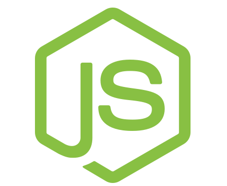

## Hi there, Im Tyree 👋
*I am a Full-Stack Developer with a background in Sales and Constrution Management.  I enjoy building web applications and services in various fields and finding ways to help business build their online presense.*

### Technologies I have learned
| HTML5 | CSS3 | Javascipt | Ruby on Rails |
| jQuery | React.js | Node.js | postgreSQL |
| Express | Mongoose | Bootstrap |

### Some of my most used skills:

  

### Find me at

[LinkedIn](https://www.linkedin.com/in/tyree-christensen-9283b26a/) 
[DevIO](https://dev.to/tyree83) 
[Twitter](https://twitter.com/tyree_c)
